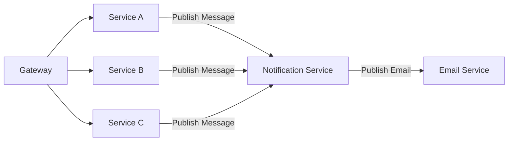

# Notification Service

## Description

Service to centralized notification from other service

## Usage at Other Services

- To use `notification service`, other service should communicate through Pubsub messaging.

## Prerequisites

To start the `notification-service`, you need to have the following prerequisites.

1. [Python 3.8 or later](https://www.python.org/)
2. [Poetry](https://python-poetry.org/docs/)
3. [Pubsub Emulator](https://cloud.google.com/pubsub/docs/emulator) [(with docker)](https://github.com/alma/gcp-pubsub-emulator)
4. [Postgres](https://www.postgresql.org/)

## How to start?

To start developing `notification-service`, you need to do following steps on your machine.

1. `git clone` this repo
2. `poetry shell` will set your terminal to the venv to your current project
3. `poetry install` will installs all dependencies on your system
4. copy `.env.sample` to set your own env used for developing

## Documentation

[Wiki](https://gitlab.internal.verihubs.com/verihubs-engineering/cloud-services/utility/notification-service/-/wikis/home)

[Changelog](CHANGELOG.md)

## Contact

If anything happened, raise the issue at Verihubs - Engineering Slack Channel.
